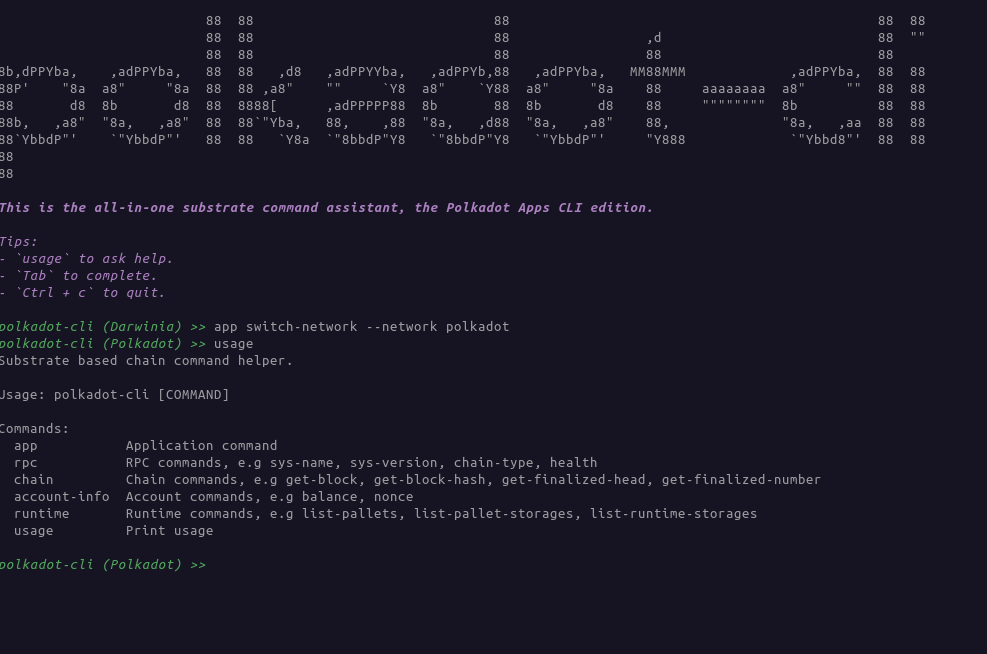

# polkadot-cli

This interactive CLI tool is designed for effortless interaction with Substrate-based chains, using the polkadot-sdk. Its goal is to offer functionality akin to that of the Polkadot Apps.

```sh
$ polkadot-cli
```




# Usage
