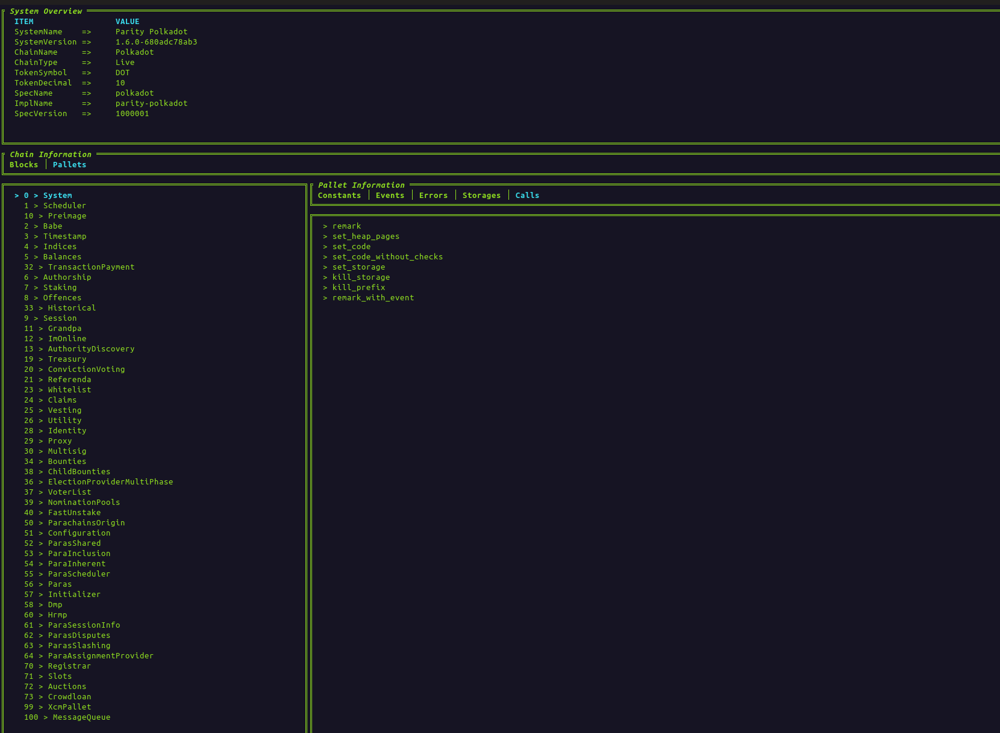

# polkadot-cli

This interactive CLI tool is designed for effortless interaction with Substrate-based chains, using the [polkadot-sdk](https://github.com/paritytech/polkadot-sdk). Its goal is to offer functionality akin to that of the Polkadot Apps.

```sh
$ polkadot-cli
```


# Highlight Features

1. Switch networks with a simple command

    ```
    $ app switch-network --network polkadot
    ```

2. App Dashboard to view the concrete runtime information, such as runtime version, pallet information.

    ```sh
    $ app dash-board
    ```


    

3. Command completion, try to type `usage` yourself.